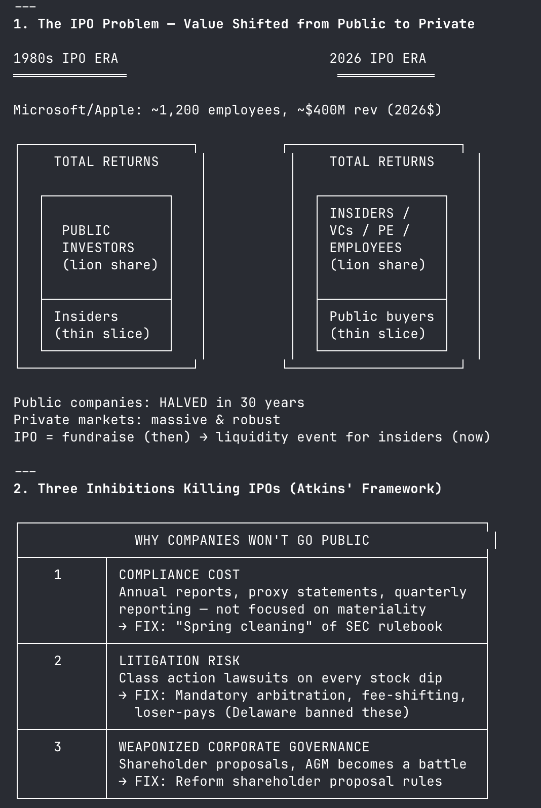
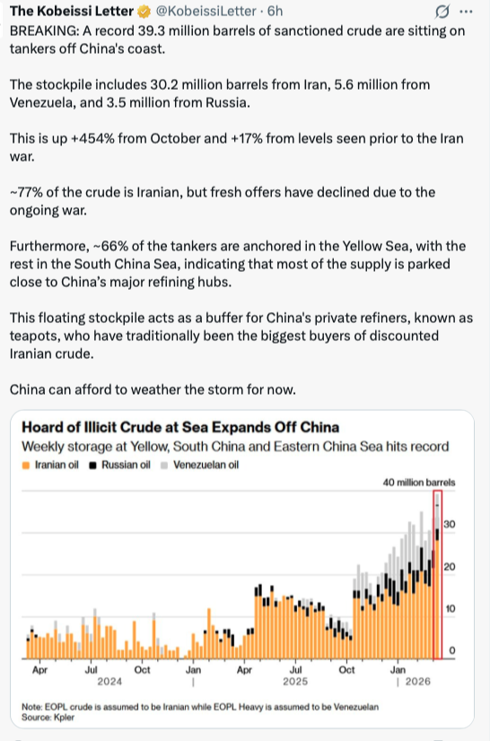
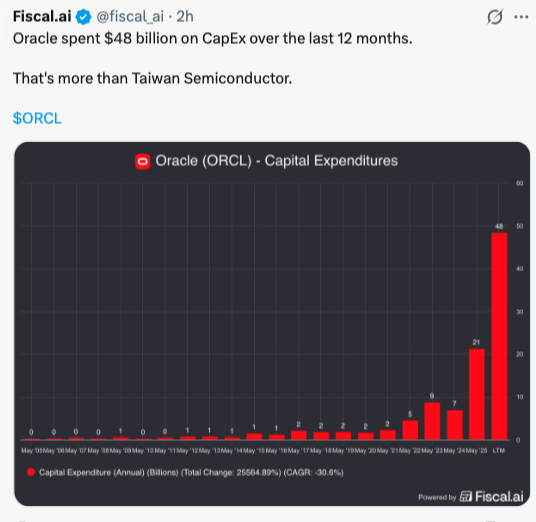
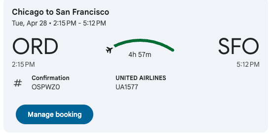
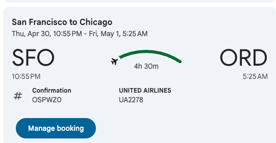

# Table of Contents

- [Thursday March 12, 2026](#thursday-march-12-2026)
- [Wednesday March 11, 2026](#wednesday-march-11-2026)
- [Tuesday March 10, 2026](#tuesday-march-10-2026)
  - [News](#news)
  - [Work todos](#work-todos)
  - [TODO](#todo)
  - [Regular todos](#regular-todos)
  - [Action Items and Notes](#action-items-and-notes)

## Sunday, March 15, 2026

### News

- Reporting requirements, litigation risk and weaponized governance
- Self certification from SEC <-> CFTC, and ATS
- Tokenized security is SEC rules, digital token is cftc
- Part A swap data repo (transparency), cftc monitors reports

- US struck Iran's main oil terminal, israel air defense low, Saudi and countries going to ukraine for drones
- AT&T cutting deals, trump's legislation cuasing issues with Republicans
- Equity giving pledge by J-Cal
- Oil price volatility. trump doctrine is not necon doctrine,IEA released 400M barrels, summit with Xi,
- China 20% of oil form Iran + Venezuela, 25% youth unemployment
- AI J curve, anthropic 1bn -> 14bn in 14 months, 12x YoY grow, Value at 380$bn, but databricks and snowflake are crucial, AI isnt?
- Washintgon +9.9% tax -> schultz to florida miami
- Cali tax -> bezos to texas 2023. • 71% of Monte Carlo runs → NEGATIVE NPV. $2500 more tax burden per head
- AMI $1bn, interpositive acquired.

### Work todos

- Jacob Firing, J Quirk, Raymond, Regina, creative block, zanrail
- Alice closed, Chantal coming in person tomorrow, meeting on Tuesday with Monica
- Wednesday time for movie
- Logan, Ben me lunch and walk, Lily and Joel meetup yesterday, Tara texted
- Add to not another gco
- Aisa showing attitude to Sam, Liao and Lily chat
- Talked about Taalas, MatX with Andrew, 4.6 1m default
- Todo one on one's, everyday pick someone and public train
- Frisbee and Jim review
- Don Carter Project finish -> raw product dailies -> train bespoke model, habd filmmakers an engine, mastercard crypto network with circle.

## Saturday, March 14, 2026

### News

- Nvidia inference chip: https://www.ft.com/content/849fab2d-0d04-411d-8fbb-7fe3b515f5bf
- Chip Analysis: https://newsletter.semianalysis.com/p/the-great-ai-silicon-shortage?_gl=1*1hgczxi*_ga*NjAzNTg5NTMxLjE3NzM1MjIwMTQ.*_ga_FKWNM9FBZ3*czE3NzM1MjIwMTQkbzEkZzAkdDE3NzM1MjIwMTQkajYwJGwwJGgxNzI2Mjk3MDYz
- Dwarkesh and Dylan podcast
- All In

### Todos

- Liao meetup
- Sauna + Jack left (taught him claude code), no luck with Gilbarco, need DRB
- App needs to be given access to, get review + case study link sent
- Sent to Patriot Team as well.
- Cooked food, need to get laundry, read book

## Friday, March 13, 2026

### News

- axios raise $200M mechanistic intrepratability, similar to fireblocks, adding determinism to AI instead of statistically, use Lean like Harmonic
- slate used for orchestrating agents
- Cursor Bench for internal cursor eval, evals multi dimensional AI performance, openclaw RL framework for making openclaw better
- Bytedance got nvidia chips, Aolani claude for 500 blackwells in Malaysia, $2.5Bn in hardware

### News

- Iran laying mines in the strait of hormuz, France sending warships, brent crude at $100 a barrel, gdp growth 0.7% this year
- Goldman says first rate cute in september
- Elon converted $2bn investment in x-ai into stake in space x, 2 cursor researchers posted, SEC changing rules for S&P500 entry
- Honda lets go of electric vehicle plans, first time ine 1957 first annual loss reported, lucid and rivian going for models below 50k
- BYD launching luxury car, 5 mins for 800 miles,
- Meta thinking of Gemini partnerhsip, Avocado behind
- David accussed of poor calorie count, Carlyle overhauled PE team in europe, capital requirements for lenders getting eased

### Personal todos

- Haircut next week ends
- Trevin new features build
- Brad & Eddie PR and updates, Propurti updates
- CLI updated

### Work todos

- Enrin x Arkash sync on Chantal
- Connor 21st dev
- Meet Tara, nice party, runner
- Connor 21st dev cli
- Kashan 3js skill merged
- Jacob one on one resume
- Peter issue showed up, need to finish
- New devs onboarded - Jacob, Leo, Aditya, Enrin
- Chantal explanation of diffs, buyers versus seller (3 clauses), detect context change

## Thursday, March 12, 2026

### News

- Replit coding agents in integrated environment
- Cursor 50bn, anthropic institute, auto-research for slms
- OAI guide to resist prompt injection
- atlassian 10% reduction in workforce, 600mil acq. of Ben afleck company, 26Bn model by nvidia
- Russia made $1.2-2bn in taxes and 3.3-5bn in overall additional revenue

### Work Todos

- PCS need auth, onboarding flows, policies with Jim, Authorization, testing flows for tazworks, CRL
- Trevin call tomorrow, research for the Bob people, call on Monday
- Enrin feedback given
- Nobel gas follow up done
- Pr merged, Chidera and Trevin call tomorrow
- Chantal call tomorrow
- Showed Jack some skills, bm made cli
- need to do projections tomorrow

---

## Wednesday March 11, 2026

### News

**Data**

- Oracle $470B not 1T, db revenue soaring, $86.7B expected they hit $90B. On delivery, S-Cuver, 90% of cap beimg hit, backlog RPO is $553B
- Replit raise $400M at $9b
- IEA releases 400mn barrels
- Anduril to double space unit with acquisition
- Ravi Gupta 1bn for Ithaca holdings
- Nvidia 2bn with Nebius deal
- Chatgpt engagement lead more than market lead. DAU:MAU is 45% versus 22% from Gemini, WAU:MAU went from 50% to 82% from 2023, approaching insta better than spotify and gmail
- perplexity plaid annoucment

**TLDR**

- Morgan stanley preventing withdrawls, AMZN started bond sales for 100 years, including MSFT (treasury + 100 basis)
- Odd lots about fertilizer - Middle east produces most, Morocco interesting market, Russia number 2 [Odd lots](https://podcasts.apple.com/us/podcast/odd-lots/id1056200096?i=1000754620452) [About OIL](https://podcasts.apple.com/us/podcast/odd-lots/id1056200096?i=1000754422076)
- Dwarkesh's take - one person's autonomy is another person's misalignment, some history made by refusing orders (Soviet soldier who refused to shoot the night of the Berlin Wall coming down), most AIs will be employed, 100Mil cameras say each takes 1k tokens at 3bucks, 30 Bil -> 3 Bil -> cheaper than renovating a home. Government should realize private companies get more rev from public. [Dwarkesh's Take](https://youtu.be/KBPOTklFTiU?si=rQOs2Q40HSPpTiHD)
- Sierra OS on harness engineering, internal AIs for giving guardrails, easier with small companies with big companies more stakes invovled
- 173 million oil barrels from SPR released, Japan releases theirs
- Apoorva talks about no network effects from Chatgpt, Altimeter concentrated bets on big companies, not addicting like Tiktok. Analogy to whatsapp and chrome, even if you churn you come back

**Book so far**

- Mitchell at National Bank, JP Morgan son's rise to fame, risks in market, go public allocate shares at 20 for friends at big companies
- Fed doesnt raise rates, bank of england does

### Actual todos:

- [] Trevin code review
- [] Brad & Eddie Action items and todos
- [] Ken & Jeff make quickbooks sample account for testing and bug fixes
- [] Chantal disco done, call on Friday
- [] Coordinate with Enrin for Discovery
- [] Check if with Kashan for Jason's updates
- [] Leonardo sync

### Work todos:

- Trevin PRs merged
- Benmore meridian updated with new skills (need to push)
- PCS audit logging, API gateway, Kong, docs, JWT hardening in Kong, API docs, ASCII flows
- PCS CRL/Workforce PR merged
- Jay given an update, need to deploy for testing
- Jim given access to PCS repo ($2.40 for new seat)
- Old repos deleted, dependabot active
- GO 180 looms made, updates to Don given
- Home service Pass PR merged, need to check issue tomorrow morning
- Jack Frisbee coming in tomorrow, Jason Steele call with Ubiquity done, Kashan sync done

### Action Items and Notes:

- Sam chatted, levian and doghaus
- Logan meetup, possibly get Aditya involved
- Papa called - long travel, Kapadiya uncle
- Payments for PCS are priority ensure we add them
- Muma exam, GMCH work
- Hanu subscription for AI done
- Dadi call, SF updates

---

## Tuesday March 10, 2026

### News

**Screenshots**

- 
- 

**Global News**

- 20 Bn government security
- apple makes 25% iphones in india
- Novo partners with Hims
- Live nation settled
- Warren talks about corruption, 49% of Americans think Trump is corrupt

**Semianalyis**

- **NJ PJM versus ERCOT**: https://notebooklm.google.com/notebook/b7558dd6-fe54-49a4-a485-5eea3398ad08?artifactId=4d3408bf-c35c-4643-b7f9-5d48dc035cbe
- 7bn insurance paid up front, predictive model, messed up in Jan 2026 storm but still got paid, 20% increase in electricity prices blamed on big tech, ERCOT is Texas is usage based, billed up to 5k when bad times
- Energy, Capacity and Transmission & Distribution 3 components of household bill, ERCOT is energy-only no centralized capacity auction. PJM Base residual actuon secures capacity 2 years in advance using some variable resource requirement curve, ERCOT uses ORDC (Operating reserve demand curve). removed 14GW because of math changes, northern virginia is in PJM regions. prices increase because of Surging capacity auction prices

**TLDR**
[TLDR](./assets/march/tldr_march10.pdf)

- Promptfoo joins OpenAI, Anthropic sues DOJ, Ghostty's new version is out, meta acquired moltbook, china has 90% of all humanoids, copilot cowork comes out, softbank shares tank, Goldman making complex instruments for shorting loans and swaps, code review is expensive from claude
- LLM's taught like Bayesians to mimic optimial bayesian model, Tencent released Penguin VL for VLMs, AI is 56% of global search engine volume

**TBPN**

- Mira Murati got partnership with Nvidia, 30-120 in 1 yr.
- Alex wang is staying at Meta, Yann LeCun raises massive seed round for Advance Machine Intelligence labs (1B at 3.5B val)
- AI legal - Legora raises 550M for Series D $5.5B
- AI recruiting Juicebox near unicorn status, $116M after $80M series B
- Ackman $10Bn IPO for durable rev, gov trying to weed out anthropic

### Work todos:

**DONE**

- [x] Banjo **112** deal with
- [x] **060** Nobel gas handoff, GRB and Gilbarco. Jack taught how to use vercel-cli skill `npx skills add vercel/vercel --skill vercel-cli`, use haiku agents, start a new chat.
- [x] Trevin quote and timeline, **PR and fixes**
- [x] Brad & Eddie new quote, tickets made and 250 bucks charged, **PR merged**
- [x] Tim flying to Boston for Glass brothers
- [x] CRL testing needed, **PCS deployment**, 2FA, RBAC checks
- [x] Made PRs for CRL, **need to merge latest one**.
- [x] Jason slack sent for collectives, Ui updated with Kashan
- [x] Chantal sent grids, needs to be worked upon with Claude

### TODO:

- [ ] **Don Carter Legal Bugle**
- [ ] Trevin quote
- [ ] Ken & Jeff call tomorrow

### Regular todos:

- Muma **GMCH CSR proposal** - MAKE CHARTS
- Atishay Linkedin catchup
- Papa Delhi call
- Logan interview prep help
- Dom, Vineet Stripe issue resolved, 3 people going. Splitwise around 754 (zion trip + Dom's) (https://secure.splitwise.com/#/all).
- Clare emailed about Stripe
- Anasthasia texted about books

### Action Items and Notes

**SF trip**

- April 28 flight to SF
- The Westin St. Francis SF on Union Square, check in Apr 28: 335 Powell Street, San Francisco, California 94102, United States
- Ack num: #W09L9T2G, Marriott Bonvoy 160178149 
- Flight to SF conf # OSPWZ0, UA1577, 2:15pm-5:12pm 
- Flight back from SF same conf, UA2278, 10:55pm to 5:25AM 

**Splitwise Pay**

- $754.00, 

---

## Monday March 9, 2026
